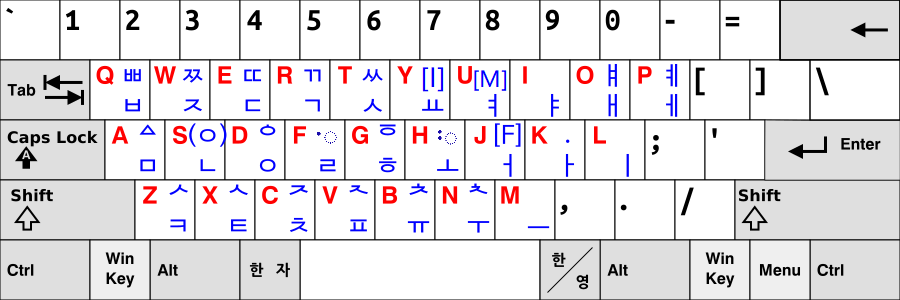

# Old Hangul Input Method

This is a Javascript-based IME for typing archaic Korean Hangul letters (e.g. ㅸ, ㅿ, ㅵ) easily in a Unicode-compliant manner. Works in all standards-compliant Web browsers!

Currently, Old Hangul Input Method supports typing characters in the 'Hangul Jamo' Unicode block. The 'Hangul Jamo Extended-A' and 'Hangul Jamo Extended-B' characters are currently unsupported for the time being. Nevertheless, pull requests to implement these additional characters are always welcome.

## How to run

1. Download this repository to your device.
2. Open `main.html` and start typing

## Keyboard layout

## Note

* (ㅇ) represents the bottom half of the letters ᄛ, ᄝ, ᄫ, ᄬ, ᅗ.
* The [F] key indicates that any consonants typed after it are for the next syllable block.
* For best results, install the 'NanumBarunGothic YetHangul' sans-serif font - most Korean Hangul fonts do not support archaic Hangul and this was the best one I could find.
  * To try other fonts, open `main.html` in a text editor. In the line containing `font-family: "NanumBarunGothic YetHangul", normal;`, replace 'NanumBarunGothic YetHangul' with the name of the preferred font.

## Diagrams

### Hangul jamo hierarchy

This is a diagram of all the Old Hangul characters that can be typed using the Old Hangul Input Method. Currently, only those in the 'Hangul Jamo' Unicode block are supported.

### Finite state machine

This diagram shows all the internal states and transitions of the Old Hangul Input Method.

